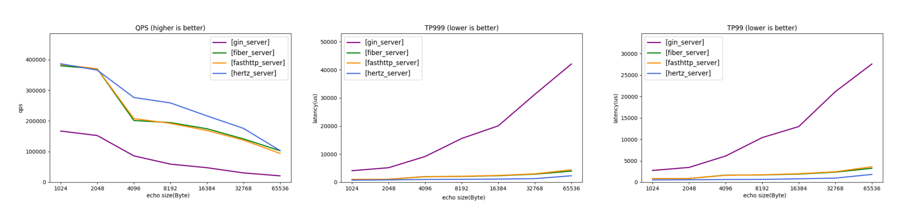
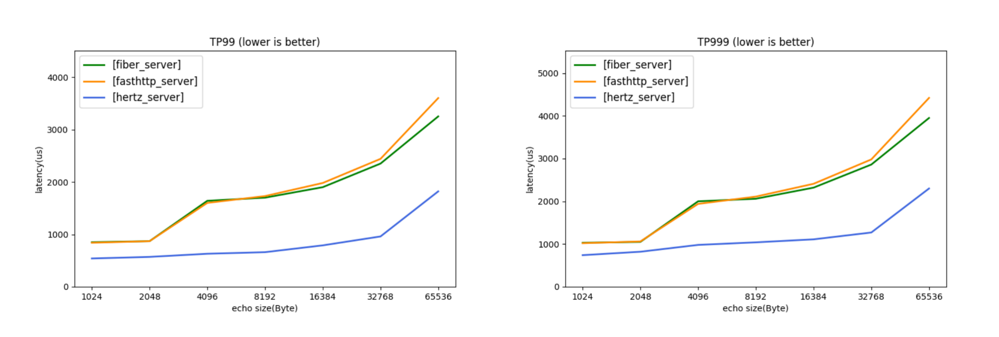

# Hertz-Benchmark

English | [中文](README_cn.md)

After researching other projects' benchmarks and HTTP usage scenarios, we believe that the Echo scenario can reflect real usage scenarios. This project provides performance records for several HTTP frameworks in the Echo scenario.

## Instructions
### Local testing
Please make sure to meet the environment requirements before executing.
### Server
```bash
./scripts/benchmark_server.sh
```
### Client
```bash
./scripts/benchmark_client.sh
```
### Profiling
Since the default test parameters will complete a test quickly, to get a longer data collection time, you can manually adjust the test parameter `n` size in `./scripts/benchmark_server.sh`.
#### Profiling Server
Refer to the corresponding script for the port mapping of different servers, e.g.:
```shell
cat ./scripts/benchmark_pb.sh

# ...
repo=("hertz" "fasthttp" "gin" "fasthttp_timeout")
ports=(8000 8001 8002 8003 8004)
```
After obtaining the corresponding server port, execute:
```shell
go tool pprof localhost:{port}/debug/pprof/{pprof_type}
```

### [wrk Benchmark](https://github.com/wg/wrk)
You can also use wrk as the load generator, refer to the following command.
```bash
./scripts/benchmark_wrk.sh

# parse data
# ${input_file} locates in /output/$(date +%F-%H-%M).log
# specify one ${output_file}
python ./scripts/wrk/parse_data.py ${input_file} ${output_file} 

# render images
python ./scripts/reports/render_images.py ${output_file}
```

### [ab Benchmark](https://httpd.apache.org/docs/2.4/programs/ab.html)
You can also use ab as the load generator, refer to the following command.
```bash
./scripts/benchmark_ab.sh

# parse data
# ${input_log_file} locates in /output/$(date +%F-%H-%M).log
# ${input_latency_file} folder locates in /output/latency_$(date +%F-%H-%M)
# specify one ${output_file}
python ./scripts/ab/parse_data.py ${input_log_file} ${input_latency_file} ${output_file} 

# render images (ab does not provide tp999)
python ./scripts/reports/render_images.py ${output_file}
```

## Environment Requirements
- OS: Linux
  - The script depends on the `taskset` command to limit the CPUs used by the client and server. If executing on other systems, please modify the script accordingly.
- CPU: Recommended configuration is >=20 cores, minimum requirement is >=4 cores
  - The default test script requires a 20-core CPU, which can be modified or removed in the `taskset -c ...` part of the script.
## Reference Data
Remarks:

The test data is obtained by filling the server with adequate machine resources, and therefore focuses more on server performance. Caller performance data will be provided in the future.
### Configuration
- CPU: AMD EPYC 7Y83 64-Core Processor 2.7GHz
  - `server` limited to 4-CPUs, `client` limited to 16-CPUS
- OS: Debian GNU/Linux 10 (buster)
- Go 1.19
### Data (Echo, 100 concurrency, 1k Header)
- Comparison of four frameworks
  
- Comparison of three frameworks
  